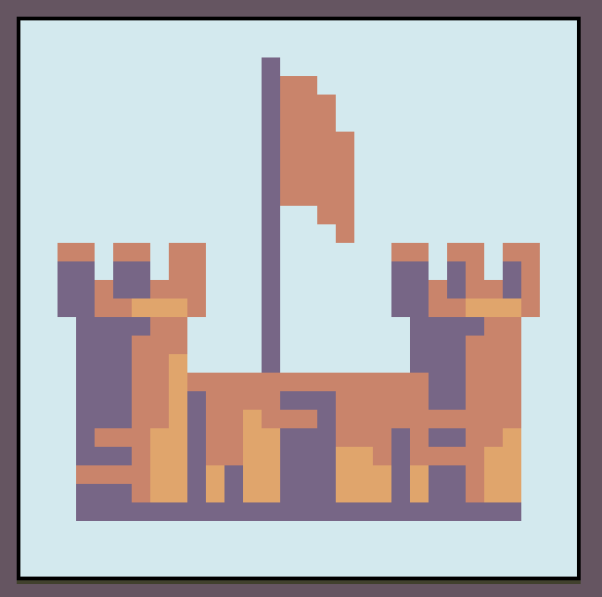

# Superultra (NNUE)

<div align="center">
 
 <p>Logo drawn by FloatingToucan</p>
</div>

## Overview
Superultra is a UCI compliant chess engine that uses an alpha-beta search framework, various heuristics and optimization techniques, and an efficiently updatable neural network (NNUE) in order to analyze chess positions and calculate moves.

## Usage
Superultra supports the UCI Protocol but does not come with a GUI (like most UCI chess engines). It is recomended to download a UCI Compatable GUI such as cutechess.

## Building
```
cd src
make
```

## Features

### Board Representation
* Bitboards
* Magic Bitboards for efficient slider attack generation

### Search
* Iterative Deepening
* Aspiration Windows
* Parallel Search with Lazy SMP
* Principle Variation Search
* Transposition Table with 4 buckets and aging (shared across threads)
* Move Ordering
  * Countermove Heuristic
  * Killer Heuristic
  * Continuation History Heuristic and History Heuristic (with gravity) 
  * MVV/LVA
  * SEE
  * Transposition Table Move
* Pruning, Reductions, and Extensions
  * Null Move Pruning 
  * Razoring
  * Reverse Futility Pruning
  * Probcut
  * Quiet Move Pruning
    * Move Count Pruning
    * Futility Pruning
    * History Pruning
  * SEE Pruning
  * Singular Extensions + Multicut Pruning
  * Late Move Reductions
* Quiescence Search
* Time Management
  * Best move stability
  * Score stability
  * Complexity based on the percentage of time spent searching moves that are not the best move 

### Evaluation
* Efficiently Updatable Neural Network
* (768x10-->512)x2-->1 architecture
  *  Perspective
  *  Crelu Activation Function
  *  10 King Buckets (mirrored)
  *  8 Output Weight Buckets

## More About the NNUE
The Neural Network is trained by a <a href="https://github.com/A1exL1ang/NNUE-Trainer/tree/main">C++ trainer</a> that I wrote myself. It is important to note that the training data I used is generated by external engines due to a lack of hardware resources. Specifically, I used data from the <a href="https://lczero.org/blog/2021/04/jumping-on-the-nnue-bandwagon">lc-fish project</a>.

## Acknowledgements
<a href="https://www.chessprogramming.org/Main_Page">Chess Programming Wiki</a> is a great resource that I used to learn about various chess programming topics. I also learned more advanced techniques, tricks, and what works through learning from the following engines. 

* <a href="https://github.com/PGG106/Alexandria">Alexandria</a> (I used Alexandria's makefile for version 1.0)
* <a href="https://github.com/jhonnold/berserk">Berserk</a>
* <a href="https://github.com/SzilBalazs/BlackCore">Black Core</a>
* <a href="https://github.com/AndyGrant/Ethereal">Ethereal</a>
* <a href="https://github.com/rafid-dev/rice">Rice</a>
* <a href="https://github.com/Disservin/Smallbrain">Small Brain</a>
* <a href="https://github.com/mhouppin/stash-bot">Stash</a>
* <a href="https://github.com/official-stockfish/Stockfish">Stockfish</a>
